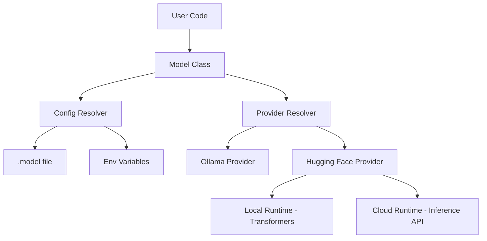

# LCM (Lightweight Chat Model) Documentation

LCM is a developer-first, unified interface for running Large Language Models across multiple providers. It abstracts away the complexity of switching between **Ollama** and **Hugging Face**, allowing you to swap backends by changing a single configuration line.

---

## 🚀 Vision

The goal of LCM is to provide a "Product-First" AI library.

- **Zero Boilerplate**: No more writing 20 lines of `asyncio` code for a simple script.
- **Unified API**: Chat, Stream, and Embed work exactly the same way regardless of the provider.
- **Actionable Errors**: Errors don't just tell you what's wrong; they tell you how to fix it.

---

## 🛠️ Installation

LCM is modular. Install only what you need:

```bash
# Core package (Configuration and Base Classes)
pip install lcm

# For Ollama support (includes httpx)
pip install lcm[ollama]

# For Hugging Face Local (Transformers, Torch, Accelerate)
pip install lcm[hf]

# Full suite (Everything above)
pip install lcm[all]
```

---

## 🏗️ Architecture

LCM sits as a thin layer between your application and the AI runtimes.



---

## ⚙️ Configuration (.model)

LCM uses a unique `.model` file system inspired by `.env` but tailored for LLMs.

### 1. The .model File Syntax

Create a `.model` file in your project root:

```ini
provider = ollama             # ollama | huggingface
model = gemma3:4b             # Model ID or name
runtime = local               # local | cloud (HF only)
stream = true                 # Global streaming default
timeout = 120                 # Connection timeout (s)
device = auto                 # For HF Local: cpu | cuda | mps
hf_token = ${HF_TOKEN}        # Interpolates env vars
```

### 2. Search Priority

LCM searches for settings in this specific order (First match wins):

1. **Explicit Constructor**: `Model(model="...")`
2. **Project File**: `./.model` (Current directory)
3. **User Config**: `~/.model` (Your Home folder for global settings)
4. **Environment Variables**: e.g., `LCM_PROVIDER=huggingface`
5. **System Defaults**: (Provider: ollama, Model: qwen2.5:7b)

---

## 📖 API Reference

### Constructor: `Model(model_name=None, **options)`

All parameters in the `.model` file can be passed as keyword arguments.

```python
from lcm import Model
model = Model("llama3", provider="ollama", timeout=30)
```

### Response Methods

LCM provides both **Modern Async** and **Simple Sync** versions of every method.

#### 1. Chat (`chat` / `chat_sync`)

Returns the full AI response as a string.

- **Async**: `await model.chat("Hi!")`
- **Sync**: `model.chat_sync("Hi!")`

#### 2. Stream (`stream` / `stream_sync`)

Yields tokens one by one for real-time interfaces.

- **Async**:
  ```python
  async for token in model.stream("Story"):
      print(token, end="", flush=True)
  ```
- **Sync**:
  ```python
  for token in model.stream_sync("Story"):
      print(token, end="", flush=True)
  ```

#### 3. Embed (`embed` / `embed_sync`)

Returns a list of floats representing the text vector.

- **Sync**: `vector = model.embed_sync("AI")`

#### 4. Health (`health` / `health_sync`)

Check if the provider is reachable and the model is ready.

- **Sync**: `status = model.health_sync()`

---

## 🔌 Provider Specifics

### 1. Ollama (Best for Local Development)

LCM treats Ollama as a local-first proxy.

- **Local Access**: Connects to `localhost:11434` by default.
- **Cloud Models**: If you use a model ending in `-cloud` (e.g., `llama3-cloud`), your local Ollama daemon handles the cloud proxying. **Note**: You must be signed in via the Ollama CLI.
- **Auto-Pull**: If a model is missing, LCM will automatically trigger a `pull` command.

### 2. Hugging Face (The Hybrid Choice)

Switch between local execution and cloud API effortlessly.

- **Cloud Runtime**: Uses the **Hugging Face Inference API**. Requires `hf_token`.
- **Local Runtime**: Uses the **Transformers library**. It will download weights to your home directory and run them on your hardware (`device`).

---

## ⚡ Quick Examples

### Simple Script (Sync Mode)

```python
from lcm import Model

model = Model() # Loads from your .model file
print(model.chat_sync("Quick fact about Mars?"))
```

### Web Server (Async Mode)

```python
from lcm import Model
from fastapi import FastAPI
from fastapi.responses import StreamingResponse

app = FastAPI()
model = Model()

@app.get("/chat")
async def chat(q: str):
    return StreamingResponse(model.stream(q))
```

---

## 🔴 Troubleshooting

| Error                         | Cause                    | The Fix                                   |
| :---------------------------- | :----------------------- | :---------------------------------------- |
| **`ConfigError`**             | Syntax error in `.model` | Check if you used `=` and lowercase keys. |
| **`RuntimeUnavailableError`** | Provider not found       | Run `ollama serve` or check internet.     |
| **`AuthError`**               | HF Token missing         | Add `hf_token = ${HF_TOKEN}` to `.model`. |
| **`ModuleNotFoundError`**     | Missing Extras           | Run `pip install lcm[all]`.               |

---

_Created by the LCM Team. Happy coding!_
